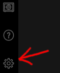
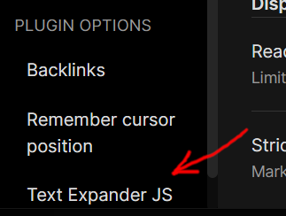

# Obsidian Plugin - Text Expander JS

***
This Obsidian plugin allows the user to type text shortcuts that are replaced by (or "expanded into") javascript generated text.

## Table of contents
- [Examples](#examples)
- [Overview](#overview)
- [HOW-TO: Setup the plugin and try it out](#how-to-setup-the-plugin-and-try-it-out)
- [HOW-TO: Add an existing shortcut-file to a vault](#how-to-add-an-existing-shortcut-file-to-a-vault)
- [HOW-TO: Create a new shortcut](#how-to-create-a-new-shortcut)
- [HOW-TO: Create a new shortcut-file](#how-to-create-a-new-shortcut-file)
- [REFERENCE: Settings](#reference-settings)
- [Known Issues](#known-issues)
- [Credits](#credits)
- [User support, bugs, feedback, dontations, etc.](#user-support-bugs-feedback-donations-etc)
- [Release notes](#release-notes)
- [TODO](#todo)

## Examples
- Typing `;;date;` can cause the text to expand into `6/7/2021`
- Typing `;;name male european;` can cause the text to expand into -> `Bill Harrington`

## Overview
Shortcuts are defined in shortcut-files, to be added to the vault as notes.  When one or more shortcut-file notes are in the vault and connected to this plugin, their shortcuts will expand when they are typed into any note in the vault.  Users can download prewritten shortcut-files into their vault, or write their own.

Individual shortcuts can also be defined in the settings.  This is useful for one-off shortcuts as it requires less work and file clutter.  It is also less flexible with shortcut organization and transfer.

## HOW-TO: Setup the plugin and try it out
1.  Walk through the process of installing and enabling the plugin (TBD once this plugin is part of the community).
2.  Open a note to try out the plugin.
3.  In the note, type `;;d100;` (or `!!d100!` on mobile).
4.  Note that the shortcut expands to a roll-result as soon as you've finished typing it.
5.  Repeat step 3.  Note that the roll result is (most likely) different.  If it is not different then you are just lucky.  Try step 3 again.

__Text Expander JS__ comes with the following shortcuts as defaults:
- date
- time
- datetime
- d{max} - dice roll.  Examples - d3, d20, d57, d999, etc.
- fd{max} - same as d{max}, but with fancier formatting.

## HOW-TO: Add an existing shortcut-file to a vault

### Shortcut-file sources
A sample of shortcut-files can be found [here](https://github.com/jon-heard/obsidian-text-expander-js_shortcutFiles).  For example, [this](https://raw.githubusercontent.com/jon-heard/obsidian-text-expander-js_shortcutFiles/main/TEJS_state.md) file contains shortcuts related to storing and reproducing "clips" of text as well as shortcuts related to saving and loading state, including stored "clips" of text.

### Step-by-step: Adding a shortcut-file to the vault
1. Make sure that the __Text Expander JS__ plugin is installed and enabled in your vault. (see [HOW-TO: Setup the plugin and try it out](#how-to-setup-the-plugin-and-try-it-out).)
2. Get the contents of a shortcut-file into a note in your vault.  You can do this one of two ways.
    - Copy the shortcut-file's text content into an empty note.
        - If the text is from github, I suggest copying from the raw file, though this isn't mandatory.
    - Copy the shortcut-file directly into your vault's folder.
3. Determine and remember the shortcut-file note's address.  This is the note's folder-path, followed by the note's name.
    - Example: `support/tejs/TEJS_state`.  The name of this shortcut-file note is `TEJS_state`, the folder-path is `support/tejs`.
4. Open the plugin options for the __Text Expander JS__ plugin.
    1. click the settings button on the lower-left of the Obsidian window.  This opens the settings panel.
    
        
    
    2. In the left menu of the settings panel, find and click __Text Expander JS__.  It is beneath "Plugin Options", near the bottom.  This opens the Plugin options for
__Text Expander JS__.

        
5. Add a reference to the shortcut-file.
    1. Find the "Shortcut-files" setting.  It is in plugin options, just beneath "Shortcut Sources" _(see picture below)_.
    2. In the "Shortcut-files" setting, click the "Add file reference" button on the right side.  This adds an empty textbox to the bottom of the "Shortcut-files" setting.  The new textbox should show the word "Filename" in grey text. _(see picture below)_
    3. Click on the new textbox and type in the shortcut-file note's address, determined in step 3.  The textbox will be red until a valid note address is entered. _(see picture below)_
        - Example: `support/tejs/TEJS_mythicV2`.
        
        
6. Close the settings panel.
    - You can hit the X button on the top right of the settings panel to close it.
    - You can click outside of the settings panel to close it.
7. The shortcuts defined in the shortcut-file should now work.  Try typing one of the shortcuts to confirm this.

### Help shortcuts
Each shortcut-file should have a "help" shortcut that lists the shortcuts provided by the file.  For example, the "state" shortcut-file includes the shortcut `help state`.  __Text Expander JS__ includes a hardcoded shortcut `help` which lists all of the help shortcuts currently active in the vault.

## HOW-TO: Create a new shortcut

### Step-by-step: Adding a shortcut
1. Make sure that the __Text Expander JS__ plugin is installed and enabled in your vault. (see [HOW-TO: Setup the plugin and try it out](#how-to-setup-the-plugin-and-try-it-out).)
2. Open the plugin options for the __Text Expander JS__ plugin.
    1. click the settings button on the lower-left of the Obsidian window.  This opens the settings panel.
    
        
    
    2. In the left menu of the settings panel, find and click __Text Expander JS__.  It is beneath "Plugin Options", near the bottom.  This opens the Plugin options for
__Text Expander JS__.

        
3. Go down to the "Shortcuts" setting.  It's the second setting in the panel, just after "Shortcut-files". _(see picture below)_
4. The setting has two buttons: "Add shortcut" and "Add defaults".  Click on the "Add shortcut" button.  This adds a shortcut entry to the bottom of the "Shortcuts" setting.  The new entry should include two textboxes with the words "Test (regex)" and "Expansion (javascript)" in grey text. _(see picture below)_
5. Enter a shortcut's Test and Expansion strings into the new entry.  I suggest starting with something simple like: Test=`test` and Expansion=`return "The test worked.";`. _(see picture below)_

    
7. Close the settings panel.
    - You can hit the X button on the top right of the settings panel to close it.
    - You can click outside of the settings panel to close it.
8. Try typing your new shortcut into a note to make sure it works.

### Shortcut components
Each shortcut is defined by a pair of strings.
- __Test string__ - This is a regex.  That means that it is a code used to identify a pattern in another string.  The Test string is regex used to determine whether a shortcut the user has typed matches _this_ shortcut.
- __Expansion string__ - This is a javascript script.  It is used to define what this shortcut expands into.  If the user types a shortcut, and it is accepted by the Test string, the Expansion string script is called and the result is added to the note, replacing the user-typed shortcut.

### Examples
| Test | Expansion | Overview |
| ---- | --------- | -------- |
| greet | return&nbsp;"Hello!&nbsp;How&nbsp;are&nbsp;you?"; | At its most basic, a Test string can just be the shortcut itself.  This example shortcut will be triggered when the user types `;;greet;` (or `!!greet!` on mobile).  Once triggered, the Expansion string's javascript is run.  In this example the javascript produces the string "Hello! How are you?".  The shortcut that the user typed (`;;greet;` or `!!greet!`) will be replaced with `Hello! How are you?`. |
| ^date$ | return&nbsp;new&nbsp;Date().toLocaleDateString(); | This shortcut's Test string is a bit more involved.  The symbols `^` and `$` are regex tokens to ensure that shortcuts like "mydate" and "datetomorrow" are not accepted, only "date".  I suggest using `^` and `$` in your shortcuts, unless there is a good reason not to.  The Expansion string is also less obvious, but is just a javascript way to get the current date.  The result of this example shortcut is: if the user types `;;date;` (or `!!date!` on mobile) it will be replaced with the current date. |
| ^age&nbsp;([0-9]+)$ | return&nbsp;"I&nbsp;am&nbsp;"&nbsp;+&nbsp;$1&nbsp;+&nbsp;"&nbsp;years&nbsp;old."; |  This shortcut's Test string has some advanced regex.  There are plenty of references and tutorials for regex online if it's not clear.  Notice the parenthesis `(`, `)`.  These are regex tokens to collect whatever is recognized within them and put it into a variable.  The first parenthesis make variable `$1`, a second parenthesis would make the variable `$2`, and so on.  These variables are available to the Expansion string.  In this example, the Expansion string _does_ reference variable `$1`.  The result of this example shortcut is: if the user types `;;age 3;` (or `!!age 3!` on mobile) the shortcut will be replaced with `I am 3 years old.`  If the user types `;;age 21;` (or `!!age 21!`), it will be replaced with `I am 21 years old.`

### The console
If the new shortcut doesn't work and it's not clear why, then the javascript console can help you.
1. Type ctrl-shift-i to open the dev-tools panel. _(see picture below)_
2. Click on the "Console" tab at the top of the dev-tools panel. _(see picture below)_
3. Review the console contents for a clue as to what is going wrong with the shortcut. _(see picture below)_
4. Try typing the shortcut into a note while the console is open to see if an error is added to the console.  You can review the error message to help discover what's wrong.
5. If you are struggling with too much information in the console, you can always clear it.  There's a button to do so on the top-left of the dev-tools panel. _(see picture below)_

    

### Helper scripts
If you add a shortcut with an empty Test string, then that shortcut is a "helper script".  A helper script provides common code that any shortcuts listed after it can use.

If you add a shortcut with an empty Test string AND an empty Expansion string, then that shortcut is a "helper block".  A helper block prevents any helper scripts above it from being available to any shortcuts after it.  You probably won't need helper blocks, but they are there in case you do.  They are also used to separate shortcut-files so that the helper scripts in one shortcut-file don't affect the shortcuts of other files.

Here is an example of helper scripts:

| Test id | Test  | Expansion                                                      |
| ------- | ----  | -------------------------------------------------------------- |
|    1    | greet | return "Hello!  How are you?";                                 |
|    2    |       | function roll(x) { return Math.trunc(Math.random() * x) + 1; } |
|    3    | d10   | return "Rolled " + roll(10) + " on a D10.";                    |
|    4    | d20   | return "Rolled " + roll(20) + " on a D20.";                    |
|    5    |       |                                                                |
|    6    | bye   | return "Goodbye.  Thanks for your time!";                      |

In this list of shortcuts, the second shortcut has an empty Test string.  That means that it is a "helper script". The code in its Expansion string (a function called "roll") is available to shortcuts after it.  The fifth shortcut in this list is empty in both its Test AND Expansion strings.  That means that it is a "helper block".  Shortcuts after it do not have access to helper scripts before it.  The net effect is that the third and fourth shortcuts have access to the helper script in shortcut 2, while the first and sixth shortcuts do not.

## HOW-TO: Create a new shortcut-file

### NOTE: If you make a shortcut-file you think others would like, it'd be real nice of you to share it [here](https://github.com/jon-heard/obsidian-text-expander-js/discussions)!  If it is polished and generally useful, then I'll even add it to the [main list of shortcut-files](https://github.com/jon-heard/obsidian-text-expander-js_shortcutFiles).

This HOW-TO assumes that you have read and understood `HOW-TO: Define a new text-entry shortcut`, and are at least aware that `HOW-TO: Add a text-entry shortcut-file to a vault` shows how to setup an existing shortcut-file.

A shortcut-file contains multiple shortcuts.  Each shortcut contains a Test string and an Expansion string.  A shortcut-file will typically bundle collections of shortcuts that work toward a common goal, such as particular functionality (saving & loading) or particular systems (the Mythic RPG system).

### Examples
Here is a minimal example of a shortcut-file's contents:
> ~~<br/>
> test<br/>
> ~~<br/>
> return "The test worked.";<br/>

This shortcut-file contains a single shortcut.  Notice that `~~` separate each section.

Here is another, more meaty, example:
> This is a test shortcut-file.<br/>
> It was written as an example for the plugin's HOW-TO documentation.<br/>
> <br/>
> ~~<br/>
> ^name$<br/>
> ~~<br/>
> return "John Smith";<br/>
> <br/>
> ~~<br/>
> ^expand ([a-zA-Z])$<br/>
> ~~<br/>
> return $1.repeat(10);<br/>

This shortcut-file begins with some comments, then it contains two shortcuts.  Notice that the first `~~` is placed after the comments.  Every shortcut-file has a section at the top for comments.  This includes the minimal example before this one, though in that case the comments section is empty.  Also notice that there are empty lines between sections.  Empty lines are ignored by __Text Expander JS__, so use them to help organize your shortcut-files.

### Developer mode
Developer mode is an on/off setting available in the __Text Expander JS__ plugin options _(see picture below)_.  When "Developer mode" is on, all shortcut-files will be reloaded each time you move from one note to another.  This lets you edit a shortcut-file note, then move to another note to try out your changes without needing to manually refreshing anything.  "Developer mode" adds a slight delay when switching notes, so I suggest keeping it off unless you are actively developing a shortcut-file.


### Help shortcuts
It is _highly_ recommended that every shortcut-file contain a "help" shortcut, preferrably as the first shortcut in the file.  A "help" shortcut is written to provide a reference to users of the shortcut-file.  It should expand into a list of the shortcuts and a brief description for each.  When writing a help shortcut, use "^help name$" for its Test string, where "name" is specific to the shortcut-file.  For example, the "state" shortcut-file includes the shortcut `help state`.  This pattern lets the system recognize "help" shortcuts.

### The console and helper scripts
The `HOW-TO: Define a new text-entry shortcut` section discusses the javascript console: a useful tool while developing shortcuts and shortcut-files.  It also discusses helper scripts: a useful feature for larger shortcut-files.

### Fenced code blocks
If you want a nicer experience while developing a shortcut, you can surround the expansion string in a "Javascript fenced code block".  For example, you can take this Expansion string:

> return "Hello!  How are you?";

and write it as:

> \`\`\`js
>
> return "Hello!  How are you?";
>
> \`\`\`

__Note__: The `` ` `` characters (before the "js") are backticks, the character that typically shares a key with tilde (~).

The result of the expansion is the same for both Expansion strings above, even though the second uses a "Javascript fenced code block".

Pros to using "Javascript fenced code blocks":
- Syntax highlighting
- No unwanted markdown formatting

Cons:
- Takes longer to write
- Takes up more space

__Warning__: The code block opening _must_ be ` ```js `.  ` ```javascript `, ` ```JS `, or anything else will break the Expansion string.

### Setup scripts
Shortcut-files can contain a "setup script".  A setup script will run whenever the shortuct-file is loaded, including when switching notes while in "Developer mode".  A setup script is defined as a shortcut with the Test string of `^tejs setup$`.  This feature is useful if your shortcut-file requires initialization before its shortcuts will work.

## REFERENCE: Settings
- __Shortcut-files__ - A list of addresses to notes containing shortcut-files.
    - The "Add file reference" button adds a new textbox for a shortcut-file address.
    - To the right of each shortcut-file textbox is a trashcan button.  This button lets you delete the textbox.
- __Shortcuts__ - A list of shortcuts, which are Test and Expansion string pairs.  This lets you add individual shortcuts directly, whithout needing a shortcut-file.
    - The "Add shortcut" button adds a blank entry for a new shortcut to the bottom of the Shortcuts setting.
    - The "Add defaults" button adds the default shortcuts to the end of Shortcut setting.
    - To the right of each shortcut entry is a trashcan button.  This button lets you delete the shortcut entry.
- __Prefix & Suffix__ - These settings let you define what to type on either side of a shortcut to signify it as a shortcut.  They default to `;;` and `;` on desktop platforms and `!!` and `!` on mobile platforms.
    - Both the prefix and suffix _must_ be defined.  If not then they will revert when you leave the __Text Expander JS__ plugin options.
    - The suffix string must _not_ contain the prefix string (such as prefix=`;`, suffix=`;;`).  If it does then these settings will revert when you leave the __Text Expander JS__ plugin options.
    - Any errors with the prefix & suffix entries will trigger a red "error" box with a description of what is wrong.  Check for that before leaving the __Text Expander JS__ plugin options.
- __Developer mode__ - When turned on, the shortcut-files will be reloaded whenever you change from one note to another.  This adds a slight delay, but lets you develop shortcut-files more rapidly, as they are auto-refreshed when changing notes to try out changes to shortcuts.

## Known Issues
- Undo of expansion works a bit differently between the old editor (CodeMirror 5, non-mobile) and the new editor (CodeMirror 6, mobile and new non-mobile).  When using the new editor, the triggering character does not show on undo.

## Credits
- This project was inspired by the description of Obsidian on the RPG Tips youtube video <a href='https://www.youtube.com/watch?v=XTFFzuZVcPk' target='_blank'>How I play my games in 2021</a>.
- This project was made with awareness of and deference to the <a href='https://github.com/konodyuk/obsidian-text-expander' target='_blank'>obsidian-text-expander</a> plugin (which has a more rudamentary feature set, but allows running external scripts).
- In both cases, the goal of this plugin is to fulfill a need for effortless cross-system, cross-platform operability of advanced text-expansion features.

## User support, bugs, feedback, donations, etc.

### Communication
If you...
- Need help with this plugin
- Have a bug or issue to report
- Want to share a script-file
- Want to offer feedback

... then visit the [discussions page](https://github.com/jon-heard/obsidian-text-expander-js/discussions).

### Donations
If you've found this plugin useful, then a small donation would let me know that I should keep it up.  Click below.

[](https://paypal.me/jonheard99?country.x=US&locale.x=en_US)

## Release notes

### 0.12.0
- Empty shortcut is "helperblock": it clears out helper scripts.  It is auto-added to the end of each shortcut-file
- add an automatic "help" shortcut that lists all "* help" lines.
- add to default shortcuts: date, time, datetime
- Replaced MyPlugin and MySettings titles
- Removed expansion trigger options (now only expands on final key hit)
- shortcut tests are now stored as regexp objects, instead of strings
- All CSS classes now prefixed with "tejs_" to avoid overlap with other plugins
- Expansions can now be surrounded with a javascript fenced code block

### 0.11.0
- Decent error messaging for parsing shortcut-files and when shortcut isn't recognized
- change shortcut from json to custom format: "~~"
- create scripts to playtest
- Fill in rest of readme instructions
- confirm plugin works on iphone
- polish code

### 0.10.0
- Remove "expansion trigger" option for mobile
- **Settings**: Developer mode: monitor shortcut-files for changes
- polish settings ui on mobile
- Default settings different on mobile vs non-mobile (prefix/suffix)
- bug fix: expansion incorrect with non-1-sized suffix
- fix bug: changing prefix/suffix requires plugin reload

### 0.9.0
- **Settings**: Shortcuts (definable directly in settings)
- **Settings**: each shortcut-file should have a delete button (no global "Remove file" button)
- Get working on mobile

### 0.8.0
- **Settings**: Custom CSS filename
- Replace "alert" with alternative that doesn't mess up caret
- CSS file added for settings UI (replaces inline styles)

### 0.7.0
- Adjust version format (final digit has 3 spaces, not 4)
- Fix ";;"/";" bookends to work when caret is on prefix
- **Settings**: Shortcut prefix & postfix
- **Settings**: Shortcut definitions filename
- **Settings**: Shortcut expansion hotkey

### 0.6.0
- Allow building a result from multiple shortcuts (to allow common code)
- Allow replacer to be either a string, or an array of strings to be concatenated together
- Console log when loading/unloading plugin
- Have version follow format convention (##.##.####)

### 0.5.0
- Basic implementation.  All settings hardwired

## TODO

### 0.13.0
- React to community feedback until plugin is accepted into the community.

### 1.0.0
- From beta to release (after responding to Obsidian community for, hopefully, a month)
