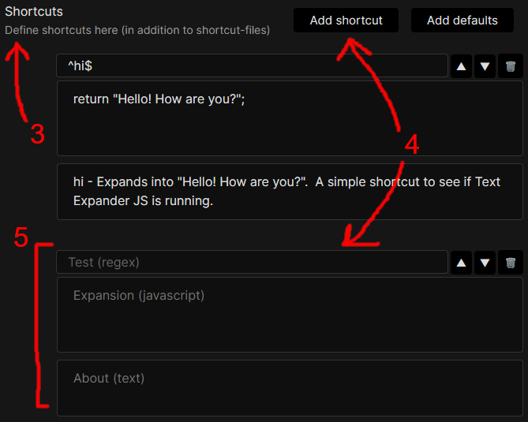
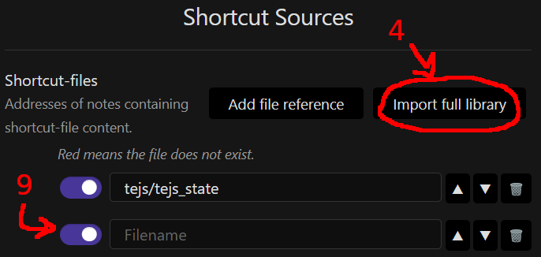
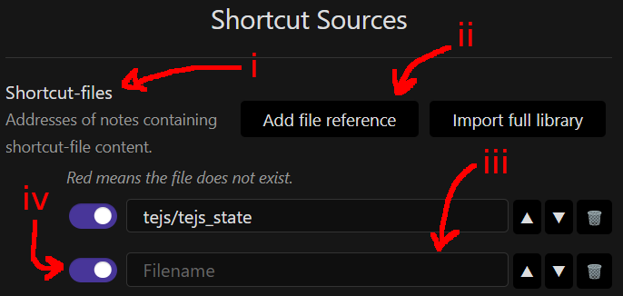
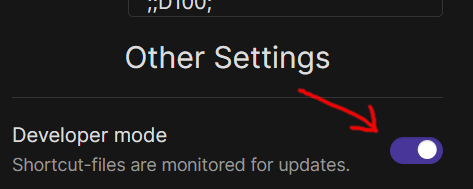
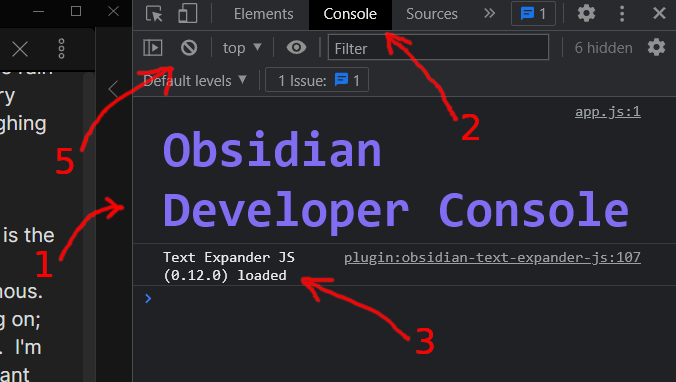
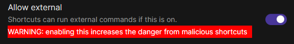

# Obsidian Plugin - Inline Scripts (open beta)


***

This Obsidian plugin lets the user type text shortcuts, each of which triggers a script (JS).  The script generates text which then replaces the typed shortcut.

This plugin works on all platforms, including mobile.  It works with the new and legacy editors (CM6 and CM5).

This plugin is currently in __open beta__.

***

## Table of contents
- General
    - [Overview](#overview)
    - [REFERENCE: Settings](#reference-settings)
    - [User support, bugs, feedback, dontations, etc.](#user-support-bugs-feedback-donations-etc)
- Tutorials &nbsp; _(suggest reading in-order)_
    1. [Setup the plugin and try it out](#tutorial-setup-the-plugin-and-try-it-out)
    2. [Create a new shortcut](#tutorial-create-a-new-shortcut)
    3. [Add an existing shortcut-file to a vault](#tutorial-add-an-existing-shortcut-file-to-a-vault)
    4. [Create a new shortcut-file](#tutorial-create-a-new-shortcut-file)
- Shortcut development topics
    - Development aids
        - [The console](#development-aid-the-console)
        - [The debugger statement](#development-aid-the-debugger-statement)
        - [Fenced code blocks](#development-aid-fenced-code-blocks)
    - Advanced shortcuts
        - [The print() function](#advanced-shortcuts-the-print-function)
        - [Running external applications and scripts](#advanced-shortcuts-running-external-applications-and-scripts)
        - [Calling shortcuts from shortcuts](#advanced-shortcuts-calling-shortcuts-from-shortcuts)
        - [Helper scripts](#advanced-shortcuts-helper-scripts)
        - [Setup and shutdown scripts](#advanced-shortcuts-setup-and-shutdown-scripts)
        - [Popup boxes for user info](#advanced-shortcuts-popup-boxes-for-user-info)
        - [Creating custom Popup boxes](#advanced-shortcuts-creating-custom-Popup-boxes)
        - [Getting info about the current expansion](#advanced-shortcuts-getting-info-about-the-current-expansion)
        - [Hiding shortcuts](#advanced-shortcuts-hiding-shortcuts)
        - [Reacting to shortcut expansions](#advanced-shortcuts-reacting-to-shortcut-expansions)
        - [Checking for loaded shortcut-files](#advanced-shortcuts-checking-for-loaded-shortcut-files)
- Technical
    - [Known Issues](#known-issues)
    - [Credits](#credits)
    - [Release notes](#release-notes)
    - [Todo](#todo)

***

## Overview

The __Inline Scripts__ plugin replaces typed shortcuts with "expansion" text generated by JavaScript, for example:
- Typing `;;date::` can cause the text to be replaced with `6/7/2022`
- Typing `;;name male european::` can cause the text to be replaced with `Bill Harrington`

The second example shows how shortcut text can include parameter text (`male european`) which can affect the resulting expansion text.

Shortcuts can be defined in the settings.  __Inline Scripts__ comes with some sample shortcuts defined by default.  See the tutorials "[Setup the plugin and try it out](#tutorial-setup-the-plugin-and-try-it-out)" and "[Create a new shortcut](#tutorial-create-a-new-shortcut)" for details.

Shortcuts can also be defined in shortcut-files, to be added to the vault as notes.  This requires a bit more work, but allows for much nicer organization and sharing of shortcuts.  Users can download prewritten shortcut-files into their vault, or write their own.  See the tutorials "[Add an existing shortcut-file to a vault](#tutorial-add-an-existing-shortcut-file-to-a-vault)" and "[Create a new shortcut-file](#tutorial-create-a-new-shortcut-file)" for details.

***

## REFERENCE: Settings
- __Shortcut-files__ - A list of addresses (folder-paths and filenames) of notes containing shortcut-files.
    - The "Add shortcut-file" button adds a new entry for a shortcut-file address.
    - The "Import full library" button downloads and sets up the entire __Inline Scripts__ shortcut-file library into your vault.  You can reimport to update your vault's library to the latest version.
    - To the left of each shortcut-file entry is a toggle button.  Turning this off causes the shortcut-file entry to be ignored by __Inline Scripts__.  It has the same effect as removing the entry from the list.
    - To the right of each shortcut-file entry are a set of buttons.
        - The up and down buttons let you move the shortcut-file entry up and down the list.
        - The trashcan button lets you delete the shortcut-file entry.
- __Shortcuts__ - A list of shortcuts, each of which contains three strings: Test, Expansion and About.  You can add individual shortcuts directly to this list to avoid the need for a shortcut-file.
    - The "Add shortcut" button adds a blank shortcut entry to the bottom of the Shortcuts setting.
    - The "Add defaults" button adds all default shortcuts to the Shortcuts setting.
    - To the right of each shortcut entry are a set of buttons.
        - The up and down buttons let you move the shortcut entry up and down the list.
        - The trashcan button lets you delete the shortcut entry.
- __Prefix & Suffix__ - These settings let you define what to type to start and end a shortcut.  They default to `;;` and `::`.
    - Both the prefix and suffix _must_ be defined.  If not then they will revert when you leave the __Inline Scripts__ plugin options.
    - The suffix string must _not_ contain the prefix string (such as prefix=`;`, suffix=`-;.`).  If it does then these settings will revert when you leave the __Inline Scripts__ plugin options.
	- The prefix and suffix must not contain any characters that trigger Obsidian's auto-closing feature.  This includes characters like `"` and `[`.
    - If there are any errors with the prefix & suffix entries, a an error message in a red box will appear above the prefix & suffix textboxes.
- __Developer mode__ - When turned on, all shortcuts will be reloaded whenever you leave a shortcut-file note (by selecting a different note, or closing the shortcut-file note).  This adds a slight delay, but lets you develop shortcut-files more rapidly.
- __Allow external__ - When turned on, shortcuts are able to run shell commands.  This is a powerful ability that a maliciously written shortcut can abuse to do serious damage to your computer.  Make sure you trust your shortcuts before turning this on.
- __Reset to defaults__ - A button that, when pressed, will change all the settings for the __Inline Script__ plugin to their initial values.

***

## User support, bugs, feedback, donations, etc.
If you...
- Need help with this plugin
- Have a bug or issue to report
- Want to share a shortcut-file or extra-useful shortcut
- Want to offer feedback

... then visit the [discussions page](https://github.com/jon-heard/obsidian-inline-scripts/discussions).

### Donations
If you've found this plugin useful, then a small donation lets me know that I should keep it up.  Thanks!

[](https://paypal.me/jonheard99?country.x=US&locale.x=en_US)

***
***

## TUTORIAL: Setup the plugin and try it out
### Setup the plugin
1. Open the vault to install __Inline Scripts__ into.  If you don't yet have a vault ready, create one now.
2. Open the Community plugins settings.
    1. Click the settings button at the lower-left of the Obsidian window (It looks like a gear).
    2. Click `Community plugins` in the left-hand menu (at the bottom of the `Options` section).
    3. If necessary, turn on community plugins (i.e. turn off "Restricted mode").
3. Browse community plugins, find __Inline Scripts__ and select it.
    1. Click the `Browse` button to the right of `Community plugins`.
    2. In the panel that pops up, click on the search textbox at the upper-left and type "inline scripts".
    3. Click "Inline Scripts" in the list below the search textbox.
4. Install and enable __Inline Scripts__
    1. To the right of the menu is information about __Inline Scripts__.  This includes a group of buttons near the top
    2. If one of the buttons is "Install", then click on that button and wait for it to go away.
    3. If one of the buttons is "Enable", then click on that button and wait for it to go away.
    4. Close the popup panels by clicking on the dark area outside of them.  Repeat until you are back to viewing your notes.

### Try out the plugin
1. Open a note to try out the plugin.
2. In the note, type `;;hi::`.  Notice that the shortcut expands to "Hello! How are you?" as soon as you've finished typing it.
3. In the note, type `;;d100::`.  Notice that the shortcut expands to a roll-result as soon as you've finished typing it.
4. Repeat step 3.  Note that the roll result is (probably) different.  If it is _not_ different, then you got lucky.  Try step 3 again.

### Default shortcut samples
__Inline Scripts__ comes with the following sample shortcuts defined by default:
- hi
- date
- time
- datetime
- d{max} - Dice roller.
    - Examples - d3, d20, d57, d999
- {count}d{max}{add} - Same as d{max}, but with optional {count} and {add}.
    - Examples - d100, 3d20, d10+5, 3d6+6

### Help shortcuts
__Inline Scripts__ has a collection of shortcuts that describe all of the shortcuts that are currently loaded.  The `help` shortcut is a good start.  It shows a list and summary of these shortcuts.

***
***

## TUTORIAL: Create a new shortcut
### Shortcut components
Each shortcut is defined by three strings.
- __Test string__ - This is a regex.  It is an expression used to identify whether a pattern exists in another string.  This Test string is regex used to determine whether shortcut text the user has typed matches _this_ shortcut.
- __Expansion string__ - This is JavaScript.  It is used to define what this shortcut expands into.  If the user types a shortcut, and it is accepted by the Test string, the Expansion string script is called and the result replaces the user-typed shortcut text.
- __About string__ - This is formatted prose to describe this shortcut's syntax, expansion and purpose.  It begins with the shortcut's syntax, then a dash, then a description of the shortcut.  __The About string _can_ be safely left blank.__

| Id | Test string | Expansion string | About string |
| -- | ----------- | ---------------- | ------------ |
|  1 | hi | return&nbsp;"Hello!&nbsp;How&nbsp;are&nbsp;you?"; | hi - Expands into "Hello! How are you?".  A simple shortcut to see if the Inline Scripts plugin is running. |
|  2 | ^date$ | return&nbsp;new&nbsp;Date().toLocaleDateString(); | Expands into the current, local date. |
|  3 | ^age&nbsp;([0-9]+)$ | return&nbsp;"I&nbsp;am&nbsp;"&nbsp;+&nbsp;$1&nbsp;+&nbsp;"&nbsp;years&nbsp;old."; | age {how old: required, >=0} - Expands into "I am {how old} years old".  {how old} can be any positive integer.  This is a demo shortcut written for this documentation. |

#### Shortcut #1 - hi (basic)
At its most basic, a Test string can just be the shortcut itself.  In this example, the shortcut will be triggered when the user types `;;hi::`.  Once triggered, the Expansion string's javascript is run.  In this example the javascript produces the string "Hello! How are you?".  The shortcut that the user typed (`;;hi::`) will be replaced with `Hello! How are you?`.

Note the format of the About string.  It contains the syntax `hi`, a dash, and then the description: the shortcut's expansion and purpose.

#### Shortcut #2 - date (intermediate)
This shortcut is a bit more involved.  The Test string contains the symbols `^` and `$`.  These are regex tokens to ensure that this shortcut isn't used for text like "mydate" and "datetomorrow", only "date".  I suggest using `^` and `$` in all of your test strings, unless there is a good reason not to.  The Expansion string is also less obvious, but is just a JavaScript way to get the current date.  The result of this example shortcut is: if the user types `;;date::` it will be replaced with the current date.

This shortcut's About string contains no syntax or purpose, only the expansion.  The purpose is obvious and so is left out.  The syntax, if ommitted, always defaults to the Test string.  For this shortcut, the About syntax is `^date$`.

#### Shortcut #3 - age (advanced)
This shortcut's Test string has some advanced regex.  If it's not clear then there is plenty of documentation online to learn regex syntax.  Notice the parenthesis `(`, `)`.  These are regex tokens to collect whatever is recognized within them and put it into a variable.  The first parenthesis are put into variable `$1`, a second parenthesis would be put into variable `$2`, and so on.  These variables are available to the Expansion string.  In this shortcut, the Expansion string _does_ reference variable `$1`.  The result of this shortcut is: if the user types `;;age 3::` the shortcut will be replaced with `I am 3 years old.`  If the user types `;;age 21::`, it will be replaced with `I am 21 years old`.

The About string starts with the syntax, including a named descriptor `{how old: required, >= 0}` representing a parameter.  `required, >= 0` lets us know that the parameter is required and is a positive integer.  After the syntax (and dash) is the expansion and purpose.

### Step-by-step: Adding a shortcut
1. Make sure that the __Inline Script__ plugin is installed and enabled in your vault. (see the tutorial [Setup the plugin and try it out](#tutorial-setup-the-plugin-and-try-it-out).)
2. Open the settings for the __Inline Script__ plugin.
    1. click the settings button on the lower-left of the Obsidian window.  This opens the settings panel.
    2. In the left-side menu of the settings panel, find and click __Inline Scripts__.  It is beneath "Community plugins", near the bottom.  This opens the settings for __Inline Scripts__.
3. Go down to the "Shortcuts" setting.  It's the second setting in the panel, just after "Shortcut-files". _(see picture below)_
4. The setting has two buttons: "Add shortcut" and "Add defaults".  Click on the "Add shortcut" button.  This adds a shortcut entry to the bottom of the list.  The new entry should include three textboxes with the greyed text "Test (regex)", "Expansion (JavaScript)" and "About (text)".  _(see picture below)_
5. Enter a shortcut's Test and Expansion strings into the new entry.  I suggest starting with something simple like: `test` and `return "The test worked.";`.  The About string is optional.  If entered, follow the format: syntax, dash, description.  _(see picture below)_

    

6. Close the settings panel.
    - You can hit the X button on the top right of the settings panel to close it.
    - You can click outside of the settings panel to close it.
7. Try typing your new shortcut into a note to make sure it works.  Example: type `;;test::`

***
***

## TUTORIAL: Add an existing shortcut-file to a vault

### A warning
Shortcuts, by their JavScript nature, have a risk of being malicious.  Make sure you trust a shortcut or shortcut-file before using it.

### Shortcut-file sources
There is a library of shortcut-files for __Inline Scripts__ [here](https://github.com/jon-heard/obsidian-inline-scripts-library).  You can bring individual shortcut-files into your vault from this library, or from any other source.  Alternately, the __Inline Scripts__ plugin has a button to import the entire library to your vault at once.

### Step-by-step: Importing the entire shortcut-file library to the vault
1. Make sure that the __Inline Scripts__ plugin is installed and enabled in your vault. (see [HOW-TO: Setup the plugin and try it out](#how-to-setup-the-plugin-and-try-it-out).)
2. Open the settings for the __Inline Scripts__ plugin.
    1. click the settings button on the lower-left of the Obsidian window.  This opens the settings panel.
    2. In the left-side menu of the settings panel, find and click __Inline Scripts__.  It is beneath "Community plugins", near the bottom.  This opens the settings for __Inline Scripts__.
3. Find the "Shortcut-files" setting.  It is just beneath "Shortcut Sources.
4. To the right of the setting is the button "Import full library".  Click on that button and then click the "Ok" button.  This will trigger the import.  It might take a minute to download, depending on your internet connection and device.

    

6. Once the import is finished, you should see a bunch of shortcut-file entries added beneath the "Shortcut-files" setting (unless they were already there from a previous import).  Close the settings panel.
    - You can hit the X button on the top right of the settings panel to close it.
    - You can click outside of the settings panel to close it.
7. All the shortcuts defined in the shortcut-file library should now work.  Try typing one of the shortcuts to confirm this, such as `;;event::` or `;;une::`.
8. You can type `;;help::` to start learning about all of the shortcuts provided by the library.
9. If you find that you need to _disable_ a shortcut-file listed in the settings, you can do so by turning off the toggle button to the left of the entry.

### Step-by-step: Adding a SINGLE shortcut-file to the vault
1. Make sure that the __Inline Scripts__ plugin is installed and enabled in your vault. (see [HOW-TO: Setup the plugin and try it out](#how-to-setup-the-plugin-and-try-it-out).)
2. Get the contents of a shortcut-file into a note in your vault.  You can do this in one of two ways.
    - Copy the shortcut-file's text content into an empty note.
        - If the shortcut-file is on github, I suggest copying the contents of the "raw file".
    - Copy the shortcut-file directly into your vault's folder.
3. Determine and remember the shortcut-file note's address in your vault.  This is the note's folder-path, followed by the note's name.
    - Example: `support/inlineScripts/state.sfile`.  The name of this shortcut-file note is `state.sfile`, the folder-path is `support/inlineScripts`.
4. Open the settings for the __Inline Scripts__ plugin.
    1. click the settings button on the lower-left of the Obsidian window.  This opens the settings panel.
    2. In the left-side menu of the settings panel, find and click __Inline Scripts__.  It is beneath "Community plugins", near the bottom.  This opens the settings for __Inline Scripts__.
5. Add a reference to the shortcut-file.
    1. Find the "Shortcut-files" setting.  It is just beneath "Shortcut Sources" _(see picture below)_.
    2. In the "Shortcut-files" setting, click the "Add shortcut-file" button on the right side.  This adds an empty entery to the bottom of the list.  The entry should show the word "Filename" in grey text. _(see picture below)_
    3. Click on the textbox, then type in the shortcut-file note's address, determined in step 3.  The textbox will be red until a valid note address has been entered. _(see picture below)_
        - Example: `support/inlineScripts/state.sfile`.
    4. (optional) Turning off the toggle button to the left of the entry will disable this shortcut-file, as if it was removed from this list.  This is is useful to stop using a shortcut file, without fully removing it from the list.
        
        

6. Close the settings panel.
    - You can hit the X button on the top right of the settings panel to close it.
    - You can click outside of the settings panel to close it.
7. The shortcuts defined in the shortcut-file should now work.  Try typing one of the shortcuts to confirm this.
8. You can type `;;help::` to start learning about all of the shortcuts provided by the new shortcut-file.

***
***

## TUTORIAL: Create a new shortcut-file

### NOTE: If you make a shortcut-file you think others would like, it'd be real nice if you could share it [here](https://github.com/jon-heard/obsidian-inline-scripts/discussions)!  If it is polished and generally useful, then I'll even add it to the [library of shortcut-files](https://github.com/jon-heard/obsidian-inline-scripts-library).

This tutorial assumes that you have read and understood the tutorial "[Create a new shortcut](#tutorial-create-a-new-shortcut)", and are at least aware that the tutorial "[Add an existing shortcut-file to a vault](#tutorial-add-an-existing-shortcut-file-to-a-vault)" shows how to setup an existing shortcut-file.

A shortcut-file contains multiple shortcuts.  Each shortcut contains three strings: Test, Expansion and About.  A shortcut-file will typically bundle collections of shortcuts that work toward a common goal, such as a particular functionality (saving & loading) or a particular system (Dungeons and Dragons).

### Examples
Here is a minimal example of a shortcut-file:
> __<br/>
> test<br/>
> __<br/>
> return "The test worked.";<br/>
> __

This shortcut-file contains a single shortcut.  Notice that `__` separate each section.

Here is another, more meaty, example:
> This is a test shortcut-file.<br/>
> It was written as an example for the plugin's HOW-TO documentation.<br/>
> <br/>
> __<br/>
> ^name$<br/>
> __<br/>
> return "Maggie Smith";<br/>
> __<br/>
> name - Expands to "Maggie smith".<br/>
> <br/>
> __<br/>
> ^repeat ([a-zA-Z])$<br/>
> __<br/>
> return $1.repeat(5);<br/>
> __<br/>
> repeat {to repeat: required, one letter} - Expands to 5 repetitions of {to repeat}: "aaaaa".<br/>
>

This shortcut-file begins with an About string, a description of the shortcut-file.  After the About string, it contains two shortcuts.  Notice that the first `__` is placed after the shorcut-file's About string.  Every shortcut-file as an About string, including the minimal example above, though in that case the About string is empty.  Also notice that there are empty lines between each section of this shortcut-file.  __Inline Scripts__ ignores empty lines in shortcut-files, so use them to organize your shortcut-files.

### Developer mode
At the bottom of the __Inline Scripts__ settings is a switch named Developer mode _(see picture below)_.  When Developer mode is on, all shortcuts will be reloaded whenever you leave a shortcut-file note, either by selecting a different note, or closing the shortcut-file note.  This lets you edit a shortcut-file note, then move to another note to try out your changes without needing to manually refreshing anything.  "Developer mode" adds a slight delay when switching notes, so I suggest keeping it off unless you are actively developing a shortcut-file.



### Help shortcuts
A shortcut-file's About text, and each shortcut's about text are used to create help shortcuts for the user.  See the section [Help shortcuts](#help-shortcuts) for more information about this.

***
***

## DEVELOPMENT AID: The console
If a new shortcut doesn't work and it's not clear why, then the javascript console can help.
1. Type ctrl-shift-i to open the dev-tools panel. _(see picture below)_
2. Click on the "Console" tab at the top of the dev-tools panel. _(see picture below)_
3. Review the console contents for a clue as to what is going wrong with the shortcut. _(see picture below)_
4. Try typing the shortcut into a note while the console is open to see if an error is added to the console.  You can review the error message for a clue as to what's wrong.
5. If you are struggling with too much information in the console, you can always clear it.  There's a button to do so on the top-left of the dev-tools panel. _(see picture below)_

    

***

## DEVELOPMENT AID: The debugger statement
If you have the console open (see [The console](#development-aid-the-console)), then you can pause an expansion mid-script, view the variables at that point, and then resume the script.  You can do this by adding `debugger;` to the script where you want to the expansion to pause.  When the expansion is run and hits `debugger;`, the script will pause.

***

## DEVELOPMENT AID: Fenced code blocks
If you want a nicer experience while developing a shortcut, you can surround the Expansion string in a "JavaScript fenced code block".  For example, this Expansion string:

> return "Hello!  How are you?";

can be written as:

> \`\`\`js
>
> return "Hello!  How are you?";
>
> \`\`\`

__Note__: The `` ` `` characters (before the "js") are backticks, the character that typically shares a key with tilde (~).

The result of the expansion is the same for both Expansion strings above, even though the second uses a "JavaScript fenced code block".

Benefits to using a "JavaScript fenced code blocks":
- Syntax highlighting
- No unwanted markdown formatting

Drawbacks:
- Takes longer to write
- Takes up more space

### Fencing test strings
You can also surround a Test string in a basic "fenced code block".  This provides no syntax highlighting, but still prevents unwanted markdown formatting.  For example, this Test string:

> ^date$

can be written as:

> \`\`\`
>
> ^date$
>
> \`\`\`

### Warning
The fenced code block _must_ be exact: ` ```js ` for Expansion string and ` ``` ` for Test string.  ` ```javascript `, ` ```JS `, or anything else will break the shortcut.

***

## ADVANCED SHORTCUTS: The print() function
`print(message)` is a function that can be called from within a shortcut's Expansion script.  It creates both a console entry and a popup notification that display the given message.  It then returns the given message.

## ADVANCED SHORTCUTS: Running external applications and scripts
This feature is unavailable on mobile (Obsidian's backend doesn't allow it).

`runExternal(command)` is a function that can be called from within a shortcut's Expansion string.  It executes the `command` parameter as a shell command and then returns the resulting console output.  This lets executables and scripts (python, M, bash, etc.) be run from within Obsidian.

NOTE: The full function is actually `runExternal(command, failSilently, dontFixSlashes)`.  The second two parameters are optional and are explained later in this section.

### The "Allow external" setting
Be aware that the runExternal function will _always_ fail with an authorization error, _unless_ the switch setting "Allow external" is turned __on__ in the plugin options.  It is off by default.



### Examples
| Test string | Expansion string | Overview |
| ----------- | ---------------- | -------- |
| ^test&nbsp;shell$ | return&nbsp;runExternal("echo&nbsp;Hello&nbsp;from&nbsp;the&nbsp;shell"); | When the user types `;;test shell::`, the shell command `echo Hello from the shell` is run, which prints "Hello from the shell" to the console.  Once the echo command is finished, its console output is returned from runExternal, then that is returned from the Expansion script and, finally, expanded into the note. |
| ^runMyScript$ | return&nbsp;runExternal("python&nbsp;myscript.py"); | When the user types `;;runMyScript::`, the command will execute python on "myscript.py", which may print something to the console.  Once the command is finished, runExternal will return any console output (or an empty string if there was none), which is then returned from the Expansion script and, thus, expanded into the note.<br/><br/>If Python is setup properly, the Expansion script could have simply been `return runExternal("myscript.py");`.<br/><br/>If python is not installed, or myscript.py is not in the vault's root folder, or even if myscript.py has a python error, then the shell command will fail.  This will cause runExternal to return null, and an error notification and console log to show up. |
| ^exec&nbsp;(.*)$ | let&nbsp;result&nbsp;=&nbsp;runExternal($1);<br/>if&nbsp;(result === null)&nbsp;{&nbsp;result&nbsp;=&nbsp;"FAILED";&nbsp;}<br/>return&nbsp;"Shell&nbsp;command&nbsp;result&nbsp;=&nbsp;\""&nbsp;+&nbsp;result&nbsp;+&nbsp;"\"."; | This shortcut allows the user to run _any_ shell command.  For example, typing `;;exec dir::` will print the vault root-folder's contents and expand them into the note. |

### Command errors
When a command produces an error:
1. The runExternal call returns null (instead of the console output)
2. A popup notification tells the user that an error has occurred
3. A console error provides detailed information:
    - The folder that the command was run from (always the vault's root folder)
    - The command that failed
    - The error message provided by the shell

The second, optional, parameter of `runExternal(command, failSilently, dontFixSlashes)` is "failSilently".  When failSilently is true and the command produces an error, runExternal still returns null, but no notification or console error are created.

### The working folder for commands
runExternal always runs commands at the vault's root folder.  This allows you to run scripts that are within the vault, meaning the scripts can be copied/synced as part of the vault.

### Obsidian pauses until a command completes
When runExternal is used to run a command, Obsidian will freeze until that command is completely finished.  This can be disconcerting if you are not ready for it, but it is harmless... unless your command runs forever, of course.

### Cross-platform slashes
By default, on Windows, any forward-slashes in the shell command are automatically flipped to back-slashes.  This helps keep commands cross-platform (always use forward-slashes in commands).  If this slash-flipping isn't wanted, though, `runExternal(command, failSilently, dontFixSlashes)` third parameter, "dontFixSlashes" can be set to true to disable it.

***

## ADVANCED SHORTCUTS: Calling shortcuts from shortcuts.
There are two features that work in tandem to allow you to nest shortcuts (i.e. use shortcut results as part of other shortcuts).  The first is the ability for an Expansion script to return a string array.  The second is the ability for an Expansion script to trigger another shortcut expansion, then get and use the result.

### Returning string arrays
Firstly: an Expansion script typically returns a string.  This string is what replaces the user-typed shortcut.  An Expansion script can, instead, return an array of strings.  This collection of strings gets joined into a single string when replacing a user-typed shortcut.

### Calling one shortcut from another
Secondly: within an Expansion script you can call the function `expand(text)`.  This function takes some text and tries to (a) find a matching shortcut (b) call the matching shortcut's Expansion script (c) get the Expansion script's result value (c) return that value.  This works just like a shortcut text that you type directly into a note, except that `expand(text)` returns the result (a string or string array), _instead_ of writing the result into the note.

### Nesting shortcuts
Given these features, here's how you can nest a shortcut within another.  The first shortcut's Expansion script calls expand(), passing in the second shortcut.  What it gets back is the second shortcut's Expansion result: a string or array of strings.  It can then use that result, or a piece of that result, as needed.

### Example
| id | Test string | Expansion string |
| -- | ----------- | ---------------- |
|  1 | firstname   | return ["FirstName: ", "Maggie"]; |
|  2 | lastname    | return ["LastName: ", "Smith"]; |
|  3 | fullname    | return [ "FullName: ", expand("firstname")[1], " ", expand("lastname")[1] ]; |

Notice that shortcut #1 returns an array of strings, but if you type `;;firstname::`, then the expansion resut is "FirstName: Maggie", since the array gets combined into a single string.  This is true for shortcut #2 as well (expanding into "LastName: Smith").

If you type `;;fullname::`, the expansion is "FullName: Maggie Smith".  This is because the array it returns is ["FullName: ", "Maggie", " ", "Smith"].  THIS is because the two calls to `expand(text)` get the result from shortcuts #1 and #2, which are arrays, then the following `[1]` gets the second string of the array.

***

## ADVANCED SHORTCUTS: Helper scripts
If you add a shortcut with an empty Test string, then that shortcut is a "helper script".  A helper script provides common code that any shortcuts listed after it can use.

### Helper-blockers
If you add a shortcut with an empty Test string AND an empty Expansion string, then that shortcut is a "helper-blocker".  A helper-blocker prevents any helper scripts above it from being available to any shortcuts after it.  You probably won't need helper-blockers, but they are there in case you do.  They are also inserted between shortcuts from different shortcut-files so that the helper scripts from one shortcut-file won't affect the shortcuts of any other files.

### Example
| id | Test string | Expansion string                                               |
| -- | ----------- | -------------------------------------------------------------- |
|  1 | hi          | return "Hello! How are you?";                                  |
|  2 |             | function roll(x) { return Math.trunc(Math.random() * x) + 1; } |
|  3 | d10         | return "Rolled " + roll(10) + " on a D10.";                    |
|  4 | d20         | return "Rolled " + roll(20) + " on a D20.";                    |
|  5 |             |                                                                |
|  6 | bye         | return "Goodbye.  Thanks for your time!";                      |

In this list of shortcuts, the shortcut #2 has an empty Test string.  That means that it is a "helper script". The code in its Expansion string (a function called "roll") is available to shortcuts after it.  Shortcut #5 is empty in both its Test AND Expansion strings.  That means that it is a "helper-blocker".  Shortcuts after it do not have access to helper scripts before it.  The net effect is that shortcuts #3 and #4 have access to the helper script, while shortcuts #1 and #6 do not.

***

## ADVANCED SHORTCUTS: Setup and shutdown scripts
A shortcut-file can contain a "setup script".  A setup script will run whenever the shortcut-file is loaded, including when switching notes while in "Developer mode".  A setup script is defined as a shortcut with a specific Test string of `^sfile setup$`.  This feature is useful if your shortcut-file requires initialization before its shortcuts will work.  Also, if the setup script returns true (or something evaluating to true), this shortcut-file's shortcuts will _not_ be added.

A shortcut-file can contain a "shutdown script".  A shutdown script will run when a shortcut-file is being disabled: when it is removed from the shortcut-file list, when it is "turned off" in the shortcut-file list, or when __Inline Scripts__ is being disabled or uninstalled.  A shutdown script is defined as a shortcut with a specific Test string of `^sfile shutdown$`.  This feature is useful if your shortcut-file needs to clean-up when being disabled.

### Example
| Test string | Expansion string | Overview |
| ----------- | ---------------- | -------- |
| ^sfile&nbsp;setup$ | window._inlineScripts.state&nbsp;\|\|=&nbsp;{};<br/>window._inlineScripts.state.clips&nbsp;\|\|=&nbsp;{}; | This setup script creates some global variables that shortcuts in the shortcut-file presumably rely upon.<br/><br/>Notice that the setup script only creates the global variables if they don't yet exist (`\|\|=`).  This is important as a setup script _may_ be run many times during a session.  We don't want later runs to wipe out anything that was created earlier. |

***

## ADVANCED SHORTCUTS: Popup boxes for user info
Sometimes an Expansion script needs information from the user that is not feasable using a shortcut's parameters.  This can include getting confirmation before a dangerous action, having the user select from a list of options or asking for too much information to reasonably type up in shortcut text.  Popup panels can help.  There are 4 kinds of popup panel:
- __popups.alert(message)__ - A popup to convey a message to the user.
- __popups.confirm(message)__ - A popup for the user to confirm or cancel an action.  Returns true if the Confirm button is clicked, false otherwise.
- __popups.input(message, defaultValue)__ - A popup for the user to enter some text.  Returns the text the user entered, or null if the user canceled.
- __popups.pick(message, options, defaultValue)__ - A popup for the user to select from a list.  Returns the index of the option the user selected, or null if the user canceled.

Usage is simple: add one of the above statements into an Expansion text.  If the statement is not an alert, you should also use the return value of the statement in some way.

### Examples
- `popup.alert("Don't forget to save!")`
- `if (popup.confirm("Are you sure?")) { doIt(); }`
- `let userName = popup.input("What is your name?", "John Smith");`
- `let color = popup.pick("What is your favorite?", [ "red", "orange", "yellow", "green", "blue", "indigo", "violet" ], 4);`

***

## ADVANCED SHORTCUTS: Creating custom Popup boxes
With some effort, and html/js skill, you can create your own custom popup boxes.  This can be useful if you need something more complicated than an alert, confirm, input or pick popup box.  Here's the syntax:
- __popups.custom(message, definition, data)__
    - message - The message to provide the user.  It works the same as for all popup boxes.
    - definition - An object that defines the custom popup box.
    - data - An object to hold parameters for the custom popup box.

The definition object for a custom popup box can include any of the following properties.  They are all optional:
- buttons - An array of strings representing what buttons are shown in the popup box.  Defaults to `[ "Ok", "Cancel" ]`.
- onOpen(data, parent, firstButton, SettingType) - A function that is called when the popup box is first opened.  It is useful for setting up a custom user interface.
    - data - The data object that was passed in to `popups.custom()`.  This is also passed to `onClose()` so it can be used to transfer data from `onOpen()` to `onClose()`.
    - parent - The html div in the popup box within which you can create the user interface.
    - firstButton - The first button element (typically the "Ok" button).  It can be useful to trigger this when the user hits the enter key in the custom user interface.
    - SettingType - obsidian.setting type: an obsidian-specific API for creating new user interface elements.
- onClose(data, resolveFnc, buttonText) - A function that is called when the popup box is closed, typically after the user clicks a button.
    - data - The data object that was passed in to `popups.custom()`.  This is also passed to `onOpen()` so it can be used to transfer data from `onOpen()` to `onClose()`.
    - resolveFnc(x) - A function that, when called, ends the `popups.custom()` call.  Pass it the value you want `popups.custom()` to return.
    - buttonText - The text of the button the user clicked to close the popup box.  This is null if the user closed the popup box without hitting a button.

### Example
```js
const definition =
{
	buttons: [ "Ok" ],
	onOpen: function(data, parent, firstButton, SettingType)
	{
		let s = document.createElement("select");
		s.appendChild(new Option("Fighter", "strong"));
		s.appendChild(new Option("Mage", "smart"));
		s.appendChild(new Option("Rogue", "nimble"));
		s.selectedIndex = data.defaultValue || 0;
		s.classList.add("dropdown");
		s.style["margin-bottom"] = "1.5em";
		s.addEventListener("keypress", (e) =>
		{
			if (e.key === "Enter")
			{
				firstButton.click();
			}
		});
		data.resultUi = s;
		parent.appendChild(s);
window.a = s;
	},
	onClose: function(data, resolveFnc, buttonText)
	{
		resolveFnc(data.resultUi.value);
	}
};
result =
	popups.custom("Pick a character", definition, { defaultValue: 1 });
return result;
```

***

## ADVANCED SHORTCUTS: Getting info about the current expansion
Expansion scripts have access to a varible `expansionInfo` which contains information about the current expansion.  expansionInfo includes:
- __expansionInfo.isUserTriggered__ - True if this expansion was caused by typing a shortcut into a note.  False if this expansion was triggered as a special script, or by calling `expand(x)`.
- __expansionInfo.line__ - The full line of text the shortcut was typed into.
- __expansionInfo.inputStart__ - Where in "line" the shortcut text entry begins.
- __expansionInfo.inputEnd__ - Where in "line" the shortcut text entry ends.
- __expansionInfo.shortcutText__ - The shortcut text that was entered (minus the prefix and postfix texts).
- __expansionInfo.prefix__ - The prefix text used to start this shortcut.
- __expansionInfo.suffix__ - The suffix text used to end this shortcut.

***

## ADVANCED SHORTCUTS: Hiding shortcuts
If the syntax string that starts a shortcut's About string is "hidden", then that shortcut will not show up in the help system (the "ref" shortcuts), though it can still be called within a note.  This is helpful to prevent cluttering the help system with shortcuts that are not useful to the user, only to other shortcuts.

***

## ADVANCED SHORTCUTS: Reacting to shortcut expansions
If a shortcut-file needs to react to shortcut expansions, it can now setup a callback function to be called on such an event.  The callback should have one parameter: `expansionInfo`.  See [Getting info about the current expansion](#advanced-shortcuts-getting-info-about-the-current-expansion) for details on `expansionInfo`.  A callback is registered by assigning the function to a unique key in `window._inlineScripts.listeners.inlineScripts.onExpansion`.  Note that this object heirarchy isn't created automatically, and must be manually created if it doesn't already exist.

In addition, if the callback function returns a string, then _that_ string is expanded as a shortcut and the result replaces the old expansion.

### Example shortcut-file
```
__
^sfile setup$
__
window._inlineScripts ||= {};
window._inlineScripts.listeners ||= {};
window._inlineScripts.listeners.inlineScripts ||= {};
window._inlineScripts.listeners.inlineScripts.onExpansion ||= {};
window._inlineScripts.listeners.inlineScripts.onExpansion.testCallback ||= (expansionInfo) =>
{
	if (expansionInfo.shortcutText.contains("d"))
	{
		// Force expansion to be result of the "hi" shortcut
		return "hi";
	}
	else
	{
		print("Shortcut input '" + expansionInfo.shortcutText + "' expanded to '" + expansionInfo.expansionText + "'.");
	}
};
__

__
^sfile shutdown$
__
delete window._inlineScripts.listeners?.inlineScripts?.onExpansion?.testCallback;
__
```

***

## Known Issues
- Undo of expansion works a bit differently between the old editor (CodeMirror 5, non-mobile) and the new editor (CodeMirror 6, mobile and new non-mobile).  When using the new editor, the character that was typed just prior to the expansion does not show on undo.

***

## Credits
- This project was inspired by the description of Obsidian on the RPG Tips youtube video <a href='https://www.youtube.com/watch?v=XTFFzuZVcPk' target='_blank'>How I play my games in 2021</a>.
- This project was made with awareness of and deference to the <a href='https://github.com/konodyuk/obsidian-text-expander' target='_blank'>obsidian-text-expander</a> plugin.
- In both cases, the goal of this plugin is to fulfill an existing need for effortless cross-system, cross-platform operability of advanced text-expansion features.

***

## Release notes

See the [Changelist doc](https://github.com/jon-heard/obsidian-inline-scripts/blob/main/changelist.md)

***

## Todo
- Shift from beta to release (after responding to Obsidian community for maybe a month?)
- next release
    - Have shortcut autocomplete react to parameter types (when they are provided by the syntax string)
    - have release announcements be based on what version you have in settings (can show multiple in a row, if you are behind enough).
    - Add a "donate" button to the bottom of the settings (or coffee?).  Make it look prettier (the paypal logo, vs the "donate")
    - allow links that run shortcuts on click.  The text of the link turns into the result of the shortcut, while the target of the link stays at the shortcut.
    - have a sidebar panel for shortcut buttons - buttons that, when clicked, trigger a shortcut.
        - button settings include:
            - button text
            - shortcut text (including ??? to auto-replace with input popup results on run)
            - list of captions for the ??? popup inputs
	- button values are stored in a separate file from settings
	- there are options to add button, edit/reorder a button, import buttons (appends), export buttons, clear buttons
	- there is a select with different categories of buttons.  You can select a set of buttons with the select.  One for combat, one for journey, etc.
- Find a way to allow the prefix & suffix to contain auto-closed characters - `{`, `"`, etc
